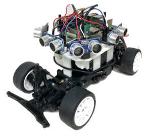

# togikaidrive
## ***Mobility for All to Study!***

超音波センサ等で自動運転するミニカーの制御プログラム。  
自動運転ミニカーバトルと出前授業等で活用。

## 主なプログラム概要
python run.pyで走行！  

| プログラム名 | 説明 |
| ------------ | ---- |
| run.py | 走行時のループ処理をするメインプログラム |
| config.py | パラメータ用プログラム |
| ultrasonic.py | 超音波測定用プログラム |
| planner.py | 走行ロジック用プログラム |
| motor.py | 操舵・モーター出力/調整用プログラム |
| train_pytorch.py | 機械学習用プログラム |

> [!NOTE]
> それぞれのプログラムは単独チェック等で活用  。
> なるべく授業活用しやすい、変更しやすいコードを目指す。

## 体験型授業
### 概要
> [!NOTE]
> 認知（超音波センサ）→判断（モードの選択/紹介）→操作（モーター出力）の順番で教える。  
> 説明で退屈しないように体験を上手く活用する。

#### 1. 超音波センサの値を確認する
~~~ shell
python ultrasonic.py
~~~ 
   - 体験例
      - 定規で距離を測り、測定値との比較をする
      - 超音波センサの測定可能範囲（角度）を手をかざして調べる
      - 超音波センサの数を変える
      - サンプリングサイクルを変える

>TODO:超音波センサの検知範囲の絵

 

#### 2. モード選択
> [!NOTE]
> ここでは、モードの詳解とお手本で動きをみせるだけ。  

config.pyを変更して保存。
~~~ python
# 判断モード選択
model_plan_list = ["GoStraight","Right_Left_3","Right_Left_3_Records","RightHand","RightHand_PID","LeftHand","LeftHand_PID","NN"]
mode_plan = "Right_Left_3"
~~~

 

#### 3. 出力調整  
PWMの数値を入れてEnterを押していく。
~~~
python motor.py
~~~
- ステアリングのPWMの値を探す。
   - 真ん中、左最大、右最大
- アクセルのPWMの値を探す。
   - ニュートラル（モータードライバーがピッピッピとなる）,
   前進の最大値、後進進の最大値
- config.pyにその値を保存する。
~~~
## ステアのPWM値
例
## ステアのPWM値
STEERING_CENTER_PWM = 370
STEERING_WIDTH_PWM = 80
STEERING_RIGHT_PWM = STEERING_CENTER_PWM + STEERING_WIDTH_PWM
STEERING_LEFT_PWM = STEERING_CENTER_PWM - STEERING_WIDTH_PWM

## アクセルのPWM値(motor.pyで調整した後値を入れる)
## モーターの回転音を聞き、音が変わらないところが最大/最小値とする
THROTTLE_STOPPED_PWM = 370
THROTTLE_FORWARD_PWM = 500
THROTTLE_REVERSE_PWM = 300
~~~

### 簡単な走行制御
#### 1. チキンレース！壁に直前で止まろう（パラスタ）  

config.pyを変更して保存。
~~~ python
# 復帰モード選択
mode_recovery = "Stop"
recovery_time = 0.3 #総復帰時間
recovery_braking = 1 #ブレーキ回数、ブレーキにはReverseを利用

# モーター出力パラメータ （デューティー比：-100~100で設定）
# スロットル用
FORWARD_S = 40 #ストレートでの値, joy_accel1
FORWARD_C = 30 #カーブでのの値, joy_accel2
REVERSE = -100 
~~~

#### 2. PID制御で舵角値をいい感じにしよう（制御の改善）  

config.pyを変更して保存。

~~~ python
mode_plan = "RightHand_PID"
#mode_plan = "LeftHand_PID"

## PIDパラメータ(PDまでを推奨)
K_P = 0.7 #0.7
K_I = 0.0 #0.0
K_D = 0.3 #0.3
~~~

#### 3. ニューラルネットワークでルールを学習しよう（ルールベースの代替）  

- config.py内下記修正
~~~ python
# NNパラメータ
HAVE_NN = True
...
## 学習済みモデルのパス
model_dir = "models"
model_name = "model_20240709_record_20240624_023159.csv_epoch_30_uls_RrLH_FrLH_Fr_FrRH_RrRH.pth"
model_path = os.path.join(model_dir, model_name)
## モデルと学習のハイパーパラメータ設定
hidden_dim = 64 #（隠れ層のノード数）
num_hidden_layers = 3 #（隠れ層の数）
batch_size = 8

## モデルの種類
model_type = "categorical" #linear, categorical
# カテゴリの設定、カテゴリ数は揃える↓　
num_categories = 3
# -100~100の範囲で小さな値→大きな値の順にする（しないとValueError: bins must increase monotonically.）
categories_Str = [RIGHT, NUTRAL, LEFT]
categories_Thr = [FORWARD_C, FORWARD_S, FORWARD_C] #Strに合わせて設定
...

~~~

- train_test_pytorch.pyで学習
~~~ shell
python train_pytorch.py
~~~

- test_pytorch.pyで確認
~~~ shell
python train_pytorch.py
~~~
model_type = "categorical"の場合、正解ラベルの正解率とconfusion matrix(混合行列)を表示。
下記の例では、1.0が予測されていない。
~~~ shell
...
正解率_Str:  92 %
confusion matrix_Str:
 Predicted  0.0  2.0   All
True
0.0        519   33   552
1.0         11   38    49
2.0          2  586   588
All        532  657  1189
~~~

#### 4. 壁にぶつかったらバックしてみよう（制御の追加変更）  
planner.pyとrun.pyを各自変更

### 走行実習
myparam_run.py内のパラメータを変更し、パラメータの変更による走行の変化を体験する
#### コース：愛知県コース（切り返しが必要になる）
 
>TODO: 愛知県コースの絵

#### コース：オーバルコース（NNの走行がスムーズになりやすい）
 
>TODO: オーバルコースの絵

### 分析実習
   1. 超音波センサの値を確認しよう（実測値のバラツキ）    
   ➔recordsのフォルダとconfigの値変更し、マシンのラズパイ上plotterで確認。
   >TODO:プロッターの絵

   2. 走行記録を視覚化してみよう（グラフ、画像、動画）  
   ~~~
   python graph.py
   ~~~
   

   >TODO:グラフの軸修正

### 発展
#### 1. fpvで操作してみよう  

   config.の値を変更。ローカルネットに接続
   ~~~ python
   # FPV 下記のport番号
   ## fpvがONの時は画像保存なし
   fpv = False #True
   port = 8910
   ~~~

#### 2. IMU（加速度、ジャイロ、地磁気センサ）を使ってみよう  
   gyroセンサーを追加し、値を計測してみる。
   ~~~ python
   python gyro.py
   ~~~
   config.の値を変更。   
   ~~~ python
   # ジャイロを使った動的制御モード選択
   HAVE_IMU = False #True
   mode_dynamic_control = "GCounter" #"GCounter", "GVectoring"
   ~~~

 

#### 3. 画像処理やディープラーニングで走る
   ＊工事中

 

## ハードウェア
### 制限部門貸し出しマシン

#### BOM（部品表）
| 分類 | 名称 | 個数 | 概算コスト(円) | 説明 |
| ---- | ---- | ---- | ---- | ---- |
| コンピュータ | [ラズパイ3B+](https://www.raspberrypi.com/products/raspberry-pi-3-model-b-plus/) |1| ---- |　販売終了
| コンピュータ | [ラズパイ3A](https://raspberry-pi.ksyic.com/main/index/pdp.id/512/pdp.open/512) |-| 5000 |（代替）|
| コンピュータ | [ラズパイ4B](https://akizukidenshi.com/catalog/g/g114839/) |-| 10000 |（代替）|
| SDカード | 配布時期による |1| ---- | 64GB以上、書き込み速度30MB/s以上推奨 |
| 距離センサ | [超音波距離センサー HC-SR04](https://akizukidenshi.com/catalog/g/g111009/) |5| 1500 | [データシート](https://akizukidenshi.com/goodsaffix/hc-sr04_v20.pdf)
| ジャイロ加速度センサ | [BNO055使用 9軸センサーフュージョンモジュールキット](https://akizukidenshi.com/catalog/g/g116996/) |任意| 2500 | [データシート](https://www.bosch-sensortec.com/media/boschsensortec/downloads/datasheets/bst-bno055-ds000.pdf)
| カメラ | [ラズベリー•パイ（Raspberry Pi）160°広角500MP](https://jp.sainsmart.com/products/wide-angle-fov160-5-megapixel-camera-module-for-raspberry-pi) |任意| 3000 |　コース内特徴を捉えるため、広角推奨。
| シャーシ | [RCスターユニット 1/14 エアロ アバンテ](https://tamiyashop.jp/shop/g/g57402/) |1| 6500 |　販売終了
| モーター | シャーシに含む |1| ---- |
| コンピュータ用バッテリ | [Anker PowerCore Fusion 5000](https://amzn.asia/d/b78Zim4) |1| 3600 |
| 駆動用バッテリ | [単３電池]() |4| 400 |
| モータドライバ | [RC ESC 20A ブラシモーター](https://www.amazon.co.jp/GoolRC-%E3%83%96%E3%83%A9%E3%82%B7%E3%83%A2%E3%83%BC%E3%82%BF%E3%83%BC-%E3%82%B9%E3%83%94%E3%83%BC%E3%83%89%E3%82%B3%E3%83%B3%E3%83%88%E3%83%AD%E3%83%BC%E3%83%A9%E3%83%BC-%E5%88%87%E3%82%8A%E6%9B%BF%E3%81%88%E5%8F%AF%E8%83%BD-%E3%83%96%E3%83%AC%E3%83%BC%E3%82%AD%E4%BB%98/dp/B014RB6WS6) |1| 1500 |
| サーボドライバ | [PCA9685 16チャンネル 12-ビット PWM Servo モーター ドライバー](https://amzn.asia/d/0sswysQ) |1| 1000 |
| コントローラー | [Logicool G ゲームパッド コントローラー F710](https://www.amazon.co.jp/%E3%83%AD%E3%82%B8%E3%82%AF%E3%83%BC%E3%83%AB-F710r-%E3%80%90%E3%83%A2%E3%83%B3%E3%82%B9%E3%82%BF%E3%83%BC%E3%83%8F%E3%83%B3%E3%82%BF%E3%83%BC%E3%83%95%E3%83%AD%E3%83%B3%E3%83%86%E3%82%A3%E3%82%A2%E6%AD%A3%E5%BC%8F%E6%8E%A8%E5%A5%A8%E3%80%91-LOGICOOL-%E3%83%AF%E3%82%A4%E3%83%A4%E3%83%AC%E3%82%B9%E3%82%B2%E3%83%BC%E3%83%A0%E3%83%91%E3%83%83%E3%83%89/dp/B00CDG7994) |1| 4000 |
| 締結部品 | [2mm六角スペーサ](https://www.amazon.co.jp/%E3%83%8A%E3%82%A4%E3%83%AD%E3%83%B3%E3%83%8D%E3%82%B8%E3%83%8A%E3%83%83%E3%83%88-320%E5%80%8B%E3%82%BB%E3%83%83%E3%83%88-%E5%85%AD%E8%A7%92%E3%82%B9%E3%83%9A%E3%83%BC%E3%82%B5%E3%83%BC-%E3%82%B9%E3%82%BF%E3%83%B3%E3%83%89%E3%82%AA%E3%83%95-%E5%8F%8E%E7%B4%8D%E3%82%B1%E3%83%BC%E3%82%B9%E4%BB%98%E3%81%8D/dp/B09G9RPC18/ref=sr_1_34_sspa?dib=eyJ2IjoiMSJ9.v2Z5JMko630Hc7v-Db1vOLYgTcYCkoMUhfz5IF_I-4JzqykRRxcumS9lJH4CKRcZ15qY-ViSoY3mtOiVZ0QP2wZkjw5S2E_UsbHvFKbaAgUxhOZUDZnY04JrS-doS5FGCc5ihOEbmM6H6voaFzNCjI46_wAnwlSwjeBHu8YuoFJTpUrYDTPbYk2T87zNKMDjfvW7avb-M0O-T4HuXnUi2xE98TZeNuB1jUJXaeh3tX3x7mQEx-yJYUpk9ZUcs2HSCpgzlfMUIAT36_JyIaXNXcYC9brXbkFmLpu3ATNf_Po.wq0WsIwMoUsaMbQw_f9EKbe3EONGyw4YZiOi3AQ8UR8&dib_tag=se&keywords=6%E8%A7%92%E3%82%B9%E3%83%9A%E3%83%BC%E3%82%B5%E3%83%BC+2mm&qid=1713080306&sr=8-34-spons&sp_csd=d2lkZ2V0TmFtZT1zcF9tdGY&psc=1) |16|1000 |ラズパイマウント用 |
| 締結部品 | 2mm六角スペーサ |6| ↑|サーボドライバ用 |
| マウント | ラズパイ/バッテリマウント |1|1000 | 材料費のみ換算
| マウント | カメラマウント |1| 300| 材料費のみ換算 |
| マウント | 超音波センサマウント |1| 500| 材料費のみ換算 |
| ケーブル | ジャンパワイヤ　メス-オス |5| 1000| 超音波センサ用 |
| ケーブル | ジャンパワイヤ　メス-メス |1| 1000| サーボドライバ用 |
| togikai基盤 | サーボドライバ代替 |任意| --- |  HC-SR04*8個接続用ジャンパピン・ PCA9685 2ch・OLED・ファン電源搭載、秋月BNO055モジュール追加搭載用I2Cスルーホール有 |

#### 組み立てマニュアル
>TODO: 情報入れる

### 制限部門貸し出しマシン２０２４～（試験走行中）
>TODO: 情報入れる

#### 環境構築
##### 選択肢１：既存のイメージをベースに環境構築
下記を実施したイメージは[こちら]()
>TODO: GDriveで配信

1. [リンク](https://drive.google.com/file/d/1uiUkqMNAAhONLD7ZHmhPery9QN9qlK32/view?usp=sharing)先をダウンロードしイメージをSDカードに焼く。
詳細は[参照](https://faboplatform.github.io/DonkeyDocs/7.SD%E3%82%AB%E3%83%BC%E3%83%89%E4%BD%9C%E6%88%90/01.os_install/)
2. [ライブラリ類](######ライブラリ類)をインストール

3. hostnameの変更

/etc/hostsと/etc/hostnameをそれぞれ下記に変更し、マシン配布時にはtogikaiの後に番号xxを付ける
~~~
donkeypi➔togikaixx
~~~

4. デスクトップ環境のインストール（お好みで）
- guiのインストール

~~~shell
sudo apt install -y xserver-xorg raspberrypi-ui-mods
raspi-config
~~~
「1.System Options」>>「S5 Boot / Auto Login」>>「B4 Desktop Autologin」で設定。

- ブラウザのインストール

~~~shell
sudo apt install firefox-esr
~~~

- 日本語入力環境のインストール
~~~shell
$ sudo apt purge fcitx fcitx-mozc
$ sudo apt autopurge
$ sudo apt update
$ sudo apt install ibus-mozc -y
~~~

- Thonny（エディター）のインストール
~~~
$ sudo apt install thonny
~~~

VScodeはラズパイから直接使うには重かった...

##### 選択肢２：まっさらなOSからインストール
1. 利用するOSは[2021-01-11-raspios-buster-i386.iso](https://downloads.raspberrypi.com/rpd_x86/images/rpd_x86-2021-01-12/2021-01-11-raspios-buster-i386.iso)  
donkeycar 4.4.0を利用しやくするため、busterを採用。

2. Win32diskimagerを使って書き込み。
https://sourceforge.net/projects/win32diskimager/

   または、Raspberry [Pi Imager](https://www.raspberrypi.com/software/)を使ってSDカードへ書き込み

3. [togikaidrive](https://github.com/autonomous-minicar-battle/togikaidrive.git)をgit cloneする
   ~~~
   git clone https://github.com/autonomous-minicar-battle/togikaidrive.git
   ~~~
4. パスワードなしSSHログイン：[参考](https://qiita.com/Ash_root/items/143f7f21373f43127da6)

5. wifiの設定ファイル設置と暗号化：[参考](https://raspida.com/wifisetupfile/)
   1. 過去wifi設定ミスっているやつでつながらない場合：
     [参考](https://tm-progapp.hatenablog.com/entry/2022/03/30/112529)

6. メモリが少ないのでswapを増やす：
   [参考](https://nekopom.jp/raspberrypi_setting09/#index_id0)

7. デフォルトでPython3系の利用  
busterのpythonはデフォルトではpython2系になっているので、python3を利用する。ついでにpip3をpipにしておく。
   ~~~
   $ cd /usr/bin
   $ sudo unlink python
   $ sudo ln -s python3 python
   $ sudo ln -s pip3 pip
   ~~~

8. [VNC](https://www.realvnc.com/)　リモートPCからマシン（ラズパイ）を操作するために活用：[参考](https://www.indoorcorgielec.com/resources/raspberry-pi/raspberry-pi-vnc/)
   1. VNCビューアーをPCにインストール
   2. ラズパイでVNCサーバーを設定
      1. スタートメニューから、「設定 -> Raspberry Piの設定」をクリックします。
      2. 設定ツールが起動するので、上部タブから「インターフェイス」を選択し、VNCの項目を有効にして、「OK」をクリックします。
      3. ラズパイのIP address、またはホスト名を入れて接続

   3. その他
   - [最新のRaspiOSでRealVNCが使えない問題の解決方法](https://qiita.com/konchi_konnection/items/c8e2258f0a7efb49302f)

   - イメージの書き出し手順
   [参考](https://zenn.dev/takeyan/books/e2c68f8be4ba54/viewer/4d3b53)

   1. [Win32 Disk Imager](https://forest.watch.impress.co.jp/docs/review/1067836.html) でラズパイのSDカードからイメージを作成
    GoogleDriveとの兼ね合いのため、[改良版](https://github.com/dnobori/DN-Win32DiskImagerRenewal)を使うことをオススメします。

   2. [Pishrink](https://github.com/Drewsif/PiShrink?fbclid=IwZXh0bgNhZW0CMTAAAR22pQNfbRI-CtGIEqEvlA_xV1-r6faoMIvvau9yBdL2gAle7n3uh6A0DTM_aem_KjcRhs5-_aCddZyr-lsXrw)を使ってイメージファイルを圧縮。
書きだしたイメージはSDカードのサイズと同じで大きな容量になってしまうのと、
   　　新しく書き込むSDカードが元のイメージより小さい（同じでもたまに失敗）場合書き込めないため、拡張がされるように圧縮します。
   ＊Linuxが必要なため、WindowsPCの人はWSLを利用。
   
   3. 圧縮されたイメージファイルをbalenaEtcherやRaspberry Pi Imagerで新しいSDカードに焼く。

###### ライブラリ類
   1. [OpenCV](https://opencv.org/)
      ~~~ 
      sudo apt install python3-opencv
      ~~~ 
   2. [Flask](https://msiz07-flask-docs-ja.readthedocs.io/ja/latest/)
      ~~~ 
      pip install Flask
      ~~~ 
   3. [Pytorch](https://pytorch.org/)
      ビルドからやると大変（でした）なので、先人のをありがたく使います。NNの講座をやるときに必要です。

      参考：https://zenn.dev/kotaproj/articles/c10c5cb3a03c52
      ~~~ 
      sudo apt update
      sudo apt upgrade
      sudo apt install libopenblas-dev libblas-dev m4 cmake cython python3-dev python3-yaml python3-setuptools
      sudo apt install libatlas-base-dev
      git clone https://github.com/Kashu7100/pytorch-armv7l.git
      cd pytorch-armv7l-main
      pip install torch-1.7.0a0-cp37-cp37m-linux_armv7l.whl
      pip install torchvision-0.8.0a0+45f960c-cp37-cp37m-linux_armv7l.whl
      ~~~
      git clone出来ないことがあるがその場合は直接[ダウンロード](https://github.com/Kashu7100/pytorch-armv7l/archive/refs/heads/main.zip)してから、pip installを実施する。

      エラーがないことを確認
      ~~~
      $ python
      >>> import torch
      >>> import torchvision
      >>> torch.__version__
      '1.7.0a0+e85d494'
      >>> torchvision.__version__
      '0.8.0a0+45f960c'
      >>> exit()      
      ~~~

   4. [matplot](https://pypi.org/project/matplotlib/)
      グラフ作成用ライブラリ
      ~~~
      pip install matplotlib
      ~~~

   4. [Adafruit_PCA9685](https://github.com/adafruit/Adafruit_Python_PCA9685)
      モーターを動かすのに使います。  
      ~~~
      pip install Adafruit_PCA9685
      ~~~
   5. [pygame](https://pypi.org/project/pygame/) コントローラーを使うときに使います。
      ~~~
      sudo apt install lightdm libsdl2-2.0-0 
      pip install pygame
      ~~~
   
   5. ジャイロに挑戦する方はインストール　たくさん種類があります。  

      - [BNO055使用 9軸センサーフュージョンモジュールキット](https://akizukidenshi.com/catalog/g/g116996/)、togikai基盤にそのまま乗ります。  
      [参考](https://github.com/ghirlekar/bno055-python-i2c) 
      ~~~
      sudo nano /etc/modules
      ~~~
      下記を追記  
      i2c-bcm2708  
      i2c-dev

      モジュールとプログラムをインストール
      ~~~
      sudo apt-get install python-smbus
      sudo apt-get install i2c-tools
      git clone https://github.com/ghirlekar/bno055-python-i2c.git
      ~~~
      i2cの接続確認テスト
      ~~~
      sudo i2cdetect -y 1
      ~~~
      サンプルプログラムの実行
      ~~~
      cd bno055-python-i2c
      python BNO055.py
      ~~~

   6. oledディスプレイの設定
      - rc.localがある場合  
      https://github.com/FaBoPlatform/ip_address_display
      - rc.localがない場合
   https://qiita.com/karaage0703/items/ed18f318a1775b28eab4#systemd-%E3%82%92%E4%BD%BF%E3%81%86%E6%96%B9%E6%B3%95

   7. donkeycar(ver. 4.4.0)をインストール
   [公式ドキュメント](https://docs.donkeycar.com/guide/robot_sbc/setup_raspberry_pi/)　

      1. 依存環境セットアップ
      ~~~
      sudo apt-get install build-essential python3 python3-dev python3-pip python3-virtualenv python3-numpy python3-picamera python3-pandas python3-rpi.gpio i2c-tools avahi-utils joystick libopenjp2-7-dev libtiff5-dev gfortran libatlas-base-dev libopenblas-dev libhdf5-serial-dev libgeos-dev git ntp
      ~~~

      2. 仮想環境セットアップ
      ~~~
      python3 -m virtualenv -p python3 env --system-site-packages
      echo "source ~/env/bin/activate" >> ~/.bashrc
      source ~/.bashrc
      ~~~

      3. プロジェクトをまとめるフォルダ作成し、移動 
      ~~~
      mkdir projects
      cd projects
      ~~~
      4. gitでdonkeycarプロジェクトを取ってくる
      ~~~
      git clone https://github.com/autorope/donkeycar
      cd donkeycar
      git fetch --all --tags -f
      git checkout 4.4.0
      pip install -e .[pi]
      pip install https://github.com/lhelontra/tensorflow-on-arm/releases/download/v2.2.0/tensorflow-2.2.0-cp37-none-linux_armv7l.whl      
      ~~~
      5. コマンドを打って確認、エラーが出なければOK
      ~~~
      donkey
      ~~~
      

## その他ツール類（開発ツール講座で一部紹介予定）
- エディター：[VS Code](https://code.visualstudio.com/) 
- コード管理：[Git](https://git-scm.com/) 
- コード配布：[GitHub](https://github.com/) 
- GUIでファイル転送：[Filezilla](https://filezilla-project.org/)
